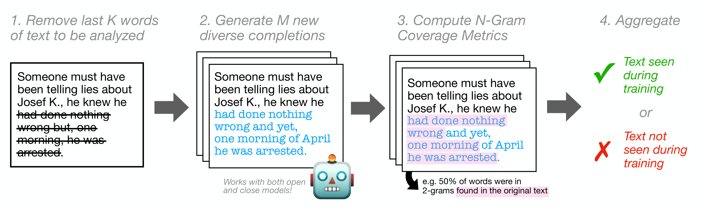

# N-Gram Coverage Attack

This is the repository for the CoLM 2025 paper ["The Surprising Effectiveness of Membership Inference with Simple N-Gram Coverage"](https://arxiv.org/abs/2508.09603)).

<p align="center">
  
</p>
## Setup

Create conda environment:
```bash
conda create -n mia python=3.10
conda activate mia
pip install -r requirements.txt
```

Create a `.env` file in the root directory of this repo with the following variables:

```
OPENAI_API_KEY=your_openai_api_key_here
CACHE_PATH=/path/to/your/cache
HF_TOKEN=your_huggingface_token_here
```

## Released Datasets

This paper introduces WikiMIA 2024 Hard, available at: https://huggingface.co/datasets/hallisky/wikiMIA-2024-hard

WikiMIA 2024 Hard is the dataset we introduce in this paper, providing a challenging benchmark for membership inference attacks.

## Citation

If you use/reference this work, please cite us via:

```bibtex
@inproceedings{hallinan2025surprising,
  title={The Surprising Effectiveness of Membership Inference with Simple N-Gram Coverage},
  author={Hallinan, Skyler and Jung, Jaehun and Sclar, Melanie and Lu, Ximing and Ravichander, Abhilasha and Ramnath, Sahana and Choi, Yejin and Karimireddy, Sai Praneeth and Mireshghallah, Niloofar and Ren, Xiang},
  booktitle={Conference on Language Modeling (CoLM)},
  year={2025}
}
```

## Contact

If you have any issues with the repository, questions about the paper, or anything else, please email skyler.r.hallinan@gmail.com or raise an issue on this repository.